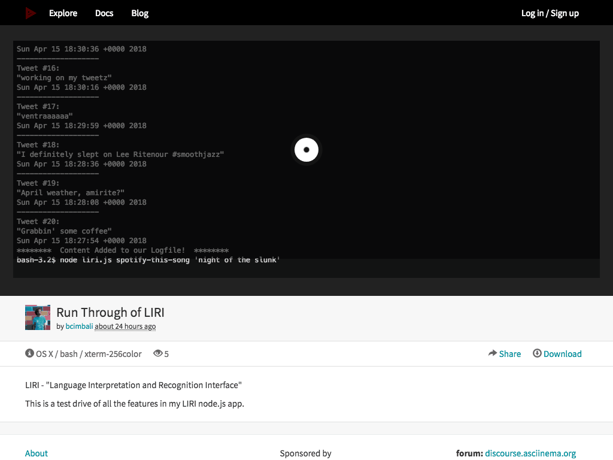

# LIRI

#
LIRI stands for "Language Interpretation and Recognition Interface."  It is a command line node app that takes in parameters and gives you back data.

## What can LIRI do?

- Display your latest tweets
- Get song information from Spotify
- Get information about a specific movie
- Receive tasks from a text file and perform them

## Setup